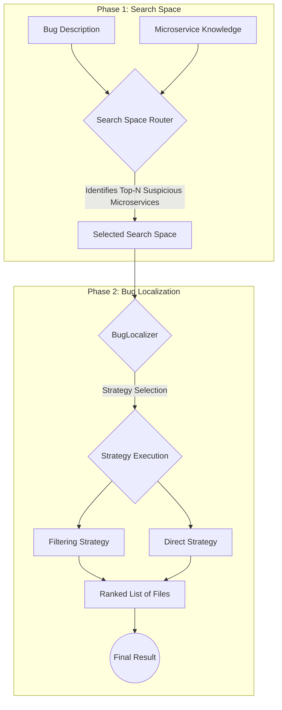

# Defect Solver 🪲

An AI-powered system for rapid bug localization in complex microservice architectures. This system uses a hierarchical understanding of codebases to intelligently route bug reports to the correct microservice and find the specific files causing the defect.

## 📖 Table of Contents
- [Defect Solver 🪲](#defect-solver-)
  - [📖 Table of Contents](#-table-of-contents)
  - [How to Use Defect Solver?](#how-to-use-defect-solver)
  - [🚀 Quick Start](#-quick-start)
  - [🏛️ High-level Architecture](#️-high-level-architecture)
  - [📄 References](#-references)
  

---

> **⚠️ Disclaimer:** Some links in this guide point to private company repositories and are only accessible to authorized team members. External users may encounter restricted access or broken links. Please contact us for public resources or further information.

## How to Use Defect Solver?

We offer a simple API to interact with the Defect Solver system. You can write your bug description in your natural language and the system will return a ranked list of `microservices` or `files` that are likely to contain the bug.

For example:
> **User:** Why is the user profile not loading?

> **Defect Solver:** The bug is likely in the `user-service` microservice, specifically in the `UserProfileController.java` file.

For now, the API is **ONLY** exposed via our MCP Server. This allows direct and easy integration with any AI development environment that supports [Model-Context Protocol](https://modelcontextprotocol.io/introduction). This includes popular IDEs like **VSCode**, **IntelliJ**, **Claude Desktop** or any MCP-compatible **Agent/LLM**.

For using our API through the MCP Server, you can either:
- Run the server locally 
  
or 

- Use our hosted version.

## 🚀 Quick Start
1. First deploy the MCP Server. You can either run it locally or use our hosted version.
   - For local deployment, follow the [MCP Server Local Deployment Guide](./docs/deployment/mcp_server_local_deployment.md).
   - For hosted version, you can use our public MCP Server at `https://mcp.defect-solver.com` (Requires API Key).
2. Install the MCP Server extension in your IDE (or any MCP-compatible environment):
   - For **VSCode**, follow the [VSCode Installation Guide](./docs/installation/vscode_installation_guide.md).
   - For **JetBrains**, follow the [JetBrains Installation Guide](./docs/installation/jetbrains_installation_guide.md).
3. Once you are connected to the MCP Server, you can start using the Defect Solver API in your IDE using the provided tools and prompts as described in the [Usage Guide](./docs/how_to_use/usage_guide.md).
4. [Optional] If your IDE supports manual Agent/LLM instructions—such as [Cursor Rules](https://docs.cursor.com/context/rules), [Windsurf Rules](https://windsurf.com/editor/directory), or chat-based interaction (e.g., [chatmode](https://code.visualstudio.com/docs/copilot/chat/chat-modes) in VSCode)—refer to the [Chat Mode Guide](./docs/how_to_use/chatmode_guide.md) for setup details.

## 🏛️ High-level Architecture

The defect solver system follows a two-phase pipeline to narrow down the search space and localize the bugs.

> For a complete breakdown of the algorithmic logic, see the **[System Architecture Document](./docs/algorithm_details/algorithm_details.md)**.

## 📄 References

This project is inspired by the principles of hierarchical code understanding to overcome the limitations of standard LLM context windows in large-scale software projects.
For more details on the underlying research, see our published paper:
[Repository-Level Code Understanding by LLMs via Hierarchical Summarization: Improving Code Search and Bug Localization](https://www.researchgate.net/publication/391739021_Repository-Level_Code_Understanding_by_LLMs_via_Hierarchical_Summarization_Improving_Code_Search_and_Bug_Localization)
