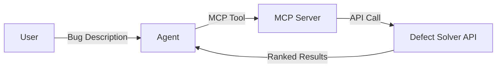

# Defect Solver 🪲

AI-powered bug localization for microservice architectures using hierarchical code understanding and LLM-based analysis.

[Research Paper](https://link.springer.com/chapter/10.1007/978-3-031-97576-9_6)

> **⚠️ Disclaimer:** Some links point to private repositories accessible only to authorized team members.

**PROJECT INDEX:**
1. [Defect Solver API](https://github.com/lokumai/defect_solver_api): locates buggy repos and files
2. [Defect Solver Codebase Summarizer](https://github.com/lokumai/defect-solver-codebase-summarizer): converts codebases to NL knowledge base
3. [Dnext Coder MCP](https://github.com/lokumai/dnext_coder_mcp_server): a gateway to acccess our API
4. [Central Storage](https://huggingface.co/spaces/dnext/ds-storage): stores NL knowledge bases
5. [Defect Solver Agent](https://github.com/lokumai/defect-solver-agent): a simple code agent to fix bugs

## What It Does

Provide a bug description in natural language, get back a ranked list of microservices and files likely containing the defect.

**Example:**
> **User:** "Why is the user profile not loading?"  
> **Defect Solver:** Bug likely in `user-service` microservice, file `UserProfileController.java`

## How It Works

The system uses MCP (Model Context Protocol) to integrate with AI development environments:

## Quick Start

1. **Connect to MCP Server** - Use hosted version at `https://dnext-coder-mcp-server.pia-team.com/mcp/`
2. **Configure Your IDE** - VSCode, JetBrains, Claude Desktop, or any MCP-compatible environment
3. **Follow Setup Guide** - See [User Guide](./docs/user_guide.md) for configuration and usage
4. **Configure AI Agent** - Copy [AGENTS.md](./resources/AGENTS.md) to your project for optimal agent behavior

## Architecture

Two-phase pipeline: **Search Space Routing** → **Bug Localization**

1. **Phase 1**: Identify top-N suspicious microservices from bug description
2. **Phase 2**: Pinpoint top-M suspicious files within selected microservices

See [Algorithm Details](./docs/algorithm.md) for complete breakdown.

## Development

For contributors and developers, see [Developer Guide](./docs/dev_guide.md).

## Research

Based on hierarchical code understanding to overcome LLM context window limitations in large-scale projects.

**Paper**: [Repository-Level Code Understanding by LLMs via Hierarchical Summarization](https://www.researchgate.net/publication/391739021_Repository-Level_Code_Understanding_by_LLMs_via_Hierarchical_Summarization_Improving_Code_Search_and_Bug_Localization)
