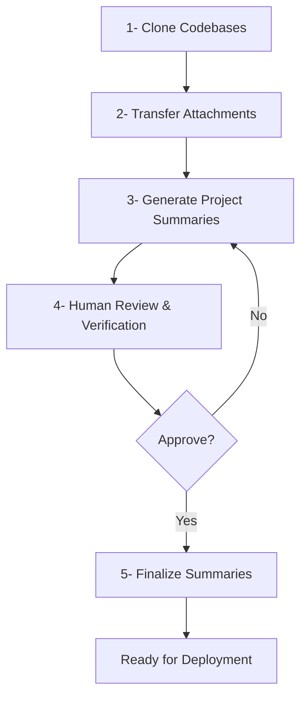

# Defect Solver Developer & Maintenance Guide

## Overview

This guide is for maintainers and developers who need to operate and maintain the Defect Solver system. The focus is on practical maintenance workflows, particularly for the **Codebase Summarizer** module which requires regular updates to keep the knowledge base current.

```
┌─────────────────────────────────────────────────────────────┐
│                    Defect Solver System                     │
├─────────────────────────────────────────────────────────────┤
│                                                             │
│  ┌──────────────────┐  ┌──────────────────┐   ┌──────────┐  │
│  │    Codebase      │  │   Bug Localizer  │   │   MCP    │  │
│  │   Summarizer     │  │       API        │   │  Server  │  │
│  │ (Requires Manual │  │   (Established)  │   │ (Gateway)│  │
│  │  Maintenance)    │  │                  │   │          │  │
│  └────────┬─────────┘  └────────┬─────────┘   └────┬─────┘  │
│           │                     │                  │        │
│           └─────────────┬───────┴──────────────────┘        │
│                         │                                   │
│                 ┌───────▼────────┐                          │
│                 │  Hugging Face  │                          │
│                 │    Storage     │                          │
│                 └────────────────┘                          │
└─────────────────────────────────────────────────────────────┘
```

---

## Module 1: Codebase Summarizer (Primary Focus)

The Codebase Summarizer generates hierarchical summaries of microservices and stores them in Hugging Face. This module requires the most maintenance.

### Prerequisites

- Python 3.8+
- LLM API keys (Gemini, OpenAI, or DeepSeek)
- GitHub access token
- Hugging Face Space ID and access token

### Initial Setup

1. **Clone the repository:**
```bash
git clone https://github.com/your-org/defect-solver-codebase-summarizer.git
cd defect-solver-codebase-summarizer
```

2. **Install dependencies:**
```bash
pip install -r requirements.txt
```

3. **Configure environment variables:**
```bash
cp .env.example .env
```

Edit `.env`:
```bash
GEMINI_API_KEY="your-key"
OPENAI_API_KEY="your-key"
GITHUB_ACCESS_TOKEN="your-token"
HF_SPACE_ID="your-hf-space-id"
HF_ACCESS_TOKEN="your-hf-token"

# Summarization settings
OVERWRITE_EXISTING_FILE_LEVEL_SUMMARIES=True
CODEBASE_SUMMARIZATION_INTERVAL_DAYS=90
MAX_RPM=10
```

### Configuration Management

Edit `configurations.yaml` to add or modify microservices:

```yaml
configurations:
  - codebase_name: product-catalog
    codebase_url: https://github.com/dnext-technology/product-catalog.git
    model: gpt-4.1-mini-2025-04-14
    base_path: src/main/java/com/pia/orbitant/productcatalog
    language: java
    valid_dir_names:
      - api
      - controller
      - service
      - repository
      # ... add relevant directories
```

**Key Fields:**
- `codebase_name`: Short identifier (used as folder name)
- `codebase_url`: GitHub repository URL
- `model`: LLM model for summarization
- `base_path`: Root path within repo to summarize
- `valid_dir_names`: Directories to include in summaries

**Adding New LLM Models:**
When using a new LLM model, you must register it in `constants.py`:
1. Add model name to appropriate provider list (e.g., `GEMINI_MODELS`, `OPENAI_MODELS`)
2. Add context window size to `CONTEXT_WINDOWS` dict

Example:
```python
GEMINI_MODELS = [
    "gemini-2.5-flash",
    "your-new-model",  # Add here
]

CONTEXT_WINDOWS = {
    "gemini-2.5-flash": 900000,
    "your-new-model": 100000,  # Add here
}
```

---

### Manual Summarization Workflow

For new microservices or major updates, run the manual preparation pipeline:

> **Why Manual Steps?** Our algorithm uses context-aware, hierarchical summarization where file-level summaries depend on project-level context. Project summaries must be generated and human-verified first to ensure accuracy, as they serve as the foundation for all subsequent automated file and directory summarizations. Once verified, the system can autonomously maintain these summaries.



#### Step-by-Step Execution

**Option 1: Automated Script**
```bash
./project_summaries_pipeline.sh
```

**Option 2: Manual Steps (Recommended)**

1. **Clone all configured codebases:**
```bash
python utilities/git_clone_all.py
```

2. **Transfer attachment files (diagrams, docs):**
```bash
python utilities/transfer_attachments.py
```
Move attachments from `input_codebases/<codebase_name>/` to `output_summaries/<codebase_name>/attachments/`

[OPTIONAL]: In this step, you can also add TMForum documents manually using Drag&Drop to the `output_summaries/<codebase_name>/attachments/` folder. Please note that when adding extra documents to the attachment, the document MUST be in text format such as `.json` or `.md` or `.xml`. NEVER put images (`.png`) or pdf files (`.pdf`) in the attachments folder !!!

3. **Generate project-level summaries:**
```bash
python utilities/generate_project_summary.py
```
Results saved to `tmp_storage/project_level_summaries/`

4. **Review and verify:**
- Check `tmp_storage/project_level_summaries/<codebase>/project_summary.txt`
- Ensure summaries are accurate and comprehensive
- Edit if needed

5. **Finalize project summaries:**
```bash
python utilities/transfer_project_summaries.py
```
Moves verified summaries to `output_summaries/<codebase>_summaries/`

---

### Automated Summarization (Server Deployment)

After manual setup, deploy the scheduler for automatic periodic updates.

#### Deployment with Docker

1. **Build Docker image:**
```bash
docker build -t defect-solver-summarizer .
```

2. **Run container:**
```bash
docker run -d \
  -e GEMINI_API_KEY="your-key" \
  -e GITHUB_ACCESS_TOKEN="your-token" \
  -e HF_SPACE_ID="your-space-id" \
  -e HF_ACCESS_TOKEN="your-token" \
  -e CODEBASE_SUMMARIZATION_INTERVAL_DAYS=90 \
  -p 7860:7860 \
  defect-solver-summarizer
```

#### How the Scheduler Works

```
┌─────────────────────────────────────────────────────────────┐
│                   Scheduler Workflow                        │
├─────────────────────────────────────────────────────────────┤
│                                                             │
│  Every N Days (configurable):                               │
│                                                             │
│  1. Pull existing summaries from HF → Local                 │
│  2. Check state.json for last run timestamp                 │
│  3. Skip if recent AND successful                           │
│  4. If outdated/failed:                                     │
│     a. Clone latest codebase from GitHub                    │
│     b. Run bottom-up summarization                          │
│     c. Update state.json                                    │
│     d. Push summaries back to HF                            │
│                                                             │
└─────────────────────────────────────────────────────────────┘
```

**Key Points:**
- Summarization runs every `CODEBASE_SUMMARIZATION_INTERVAL_DAYS` (default: 90 days)
- Skips if last run was recent AND successful
- Overwrites file summaries if `OVERWRITE_EXISTING_FILE_LEVEL_SUMMARIES=True`
- Logs saved to `output_summaries/<codebase>_summaries/state.json`

#### Check Status

View logs:
```bash
docker logs -f <container-id>
```

Check `state.json` in Hugging Face Space:
```json
{
  "last_summarized_at": "2025-11-16T10:30:00Z",
  "summarization_status": "success"
}
```

---

### Troubleshooting Summarization

**Issue: Summarization fails with API rate limits**
- Lower `MAX_RPM` in `.env`
- Use cheaper models (e.g., `gemini-2.5-flash-lite`)

**Issue: Missing summaries for some files**
- Check `valid_dir_names` in `configurations.yaml`
- Verify directory structure matches `base_path`

**Issue: Summaries outdated despite scheduler running**
- Check `state.json` for errors
- Verify HF credentials are valid
- Manually trigger: `python main.py`

---

## Module 2: Bug Localizer API

The API is largely established and requires minimal maintenance.

### Configuration

Edit `configurations.yaml`:
```yaml
configurations:
  - search_space: product-catalog
    models:
      - gpt-4.1-mini
    decider_models:
      - gpt-4.1-mini
    level: file
    valid_dir_names:
      - api
      - controller
      - service
```

### Deployment

**Docker:**
```bash
cd defect_solver_api
docker build -t defect-solver-api .
docker run -d \
  -e GEMINI_API_KEY="your-key" \
  -e ADMIN_ACCESS_KEY="your-secure-key" \
  -e MONGO_URI="mongodb+srv://..." \
  -p 8000:8000 \
  defect-solver-api
```

**Local:**
```bash
pip install -r requirements.txt
uvicorn app:app --host 0.0.0.0 --port 8000
```

### Maintenance Tasks

- **Add new microservices:** Update `configurations.yaml` and redeploy
- **Change models:** Update `models` field for each search space
- **Add new LLM models:** Register in `constants.py` (add to provider list and `CONTEXT_WINDOWS`)
- **Adjust top-N results:** Set `TOP_N_FILES`, `TOP_N_SPACES` in `.env`

---

## Module 3: MCP Server (Gateway)

The MCP server acts as a gateway between AI agents and the API.

### Configuration

Edit `.env`:
```bash
DS_API_BASE_URL=https://dnext-coder-api.pia-team.com
DS_API_SINGLEMODULE_ENDPOINT=/mcp_single_module_bug_localization
DS_API_SEARCHSPACE_ENDPOINT=/mcp_search_space_routing
TIMEOUT=120
```

### Deployment

**Docker:**
```bash
cd dnext_coder_mcp_server
docker build -t dnext-coder-mcp .
docker run -d \
  -e DS_API_BASE_URL="https://dnext-coder-api.pia-team.com" \
  -p 7860:7860 \
  dnext-coder-mcp
```

**Local:**
```bash
uv sync
python main.py
```

### Maintenance Tasks

- **Update endpoints:** Modify `config.py` if API URLs change
- **Add authentication:** Users pass `DS-API-KEY` header via MCP client config
- **Monitor logs:** Check for failed API calls or timeouts

---

## Authentication Overview

```
┌─────────────┐           ┌─────────────┐           ┌─────────────┐
│ IDE (User)  │           │ MCP Server  │           │   API       │
│             │           │  (Gateway)  │           │             │
│ DS-API-KEY  ├──────────►│             ├──────────►│ Validates   │
│  in header  │           │  Forwards   │           │  API Key    │
│             │           │   API Key   │           │             │
└─────────────┘           └─────────────┘           └─────────────┘
```

**User Auth Flow:**
1. User adds `DS-API-KEY` to IDE's MCP client config
2. MCP server extracts key from request headers
3. MCP server forwards key to Defect Solver API
4. API validates key and returns results

**Admin Key:**
- `ADMIN_ACCESS_KEY` in API `.env` for elevated access
- Used for direct API calls (not MCP)

---

## Deployment Checklist

### For Codebase Summarizer
- [ ] Configure `configurations.yaml` with all microservices
- [ ] Set variables in `.env`
- [ ] Run manual pipeline for initial summaries
- [ ] Verify summaries 
- [ ] Deploy scheduler with Docker
- [ ] Monitor 

### For Bug Localizer API
- [ ] Update `configurations.yaml` if needed
- [ ] Set variables in `.env`
- [ ] Generate secure `ADMIN_ACCESS_KEY`
- [ ] Deploy with Docker
- [ ] Test endpoints with Postman/curl
- [ ] Verify logs for errors

### For MCP Server
- [ ] Set variables in `.env`
- [ ] Deploy with Docker
- [ ] Test tool availability from IDE
- [ ] Confirm authentication works
- [ ] Monitor traffic logs

---

## Monitoring & Logs

**Codebase Summarizer:**
```bash
# Check scheduler logs
docker logs -f <summarizer-container>

# Check state files
cat output_summaries/*/state.json
```

**Bug Localizer API:**
```bash
# Check API logs
docker logs -f <api-container>

# MongoDB logs (if enabled)
# Check MONGO_COLLECTION for request history
```

**MCP Server:**
```bash
# Check MCP server logs
docker logs -f <mcp-container>
```

---

## Common Maintenance Workflows

### Adding a New Microservice

1. **Summarizer:**
   - Add config to `configurations.yaml`
   - Place attachments in `input_codebases/<name>/attachments/`
   - Run `./project_summaries_pipeline.sh`
   - Deploy updated Docker image

2. **API:**
   - Add config to `configurations.yaml`
   - Redeploy Docker image

3. **Verify:**
   - Test `search_space_routing` returns new microservice
   - Test `single_module_bug_localization` on new module

### Updating an Existing Microservice

- **For code changes:** Scheduler handles automatically (next run)
- **For config changes:** Update `configurations.yaml` and redeploy
- **For forced refresh:** Delete `state.json` in HF Space

### Rotating API Keys

1. Update `.env` files for all modules
2. Redeploy all Docker containers
3. Notify users to update `DS-API-KEY` in IDE configs

---

## Best Practices

### For Summarization
- Run manual pipeline for new repos before deploying scheduler
- Review project summaries before finalizing
- Use rate limits (`MAX_RPM`) to avoid API throttling
- Monitor HF storage quota

### For API & MCP Server
- Keep API endpoints stable (avoid breaking changes)
- Version API if major changes needed
- Log all requests for debugging
- Use secure keys (rotate regularly)

---

## Support & Resources

- **Internal Docs:** See [Algorithm Details](algorithm.md) for system internals
- **User Guide:** See [User Guide](user_guide.md) for end-user workflows
- **Research Paper:** See `paper.tex` for methodology details

For technical issues, check GitHub repositories:
- [Codebase Summarizer](https://github.com/your-org/defect-solver-codebase-summarizer)
- [Bug Localizer API](https://github.com/your-org/defect_solver_api)
- [MCP Server](https://github.com/lokumai/dnext_coder_mcp_server)
