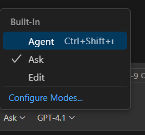
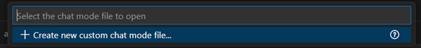
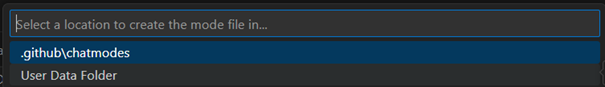
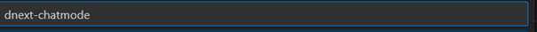
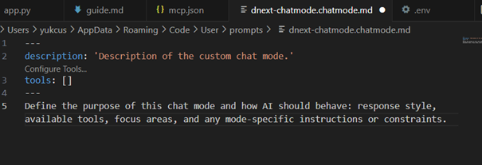
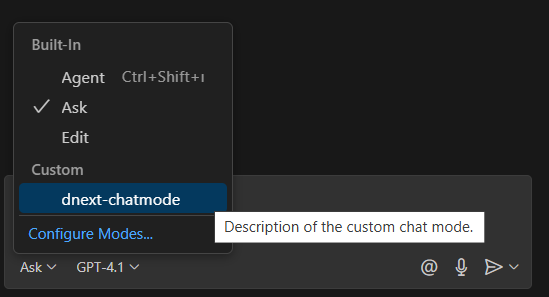

. 

## 1. What is ChatMode and What Is It Used For?
- ChatMode is a feature in GitHub Copilot Chat that allows you to define custom conversation flows for specific tasks — such as bug localization, code generation, or documentation — using pre-configured input fields and MCP tools.

- Instead of manually typing prompts or slash commands (like /mcp.defect_solver.prompt_find_bug), ChatMode provides a dedicated UI panel with input forms that guide the user through the interaction.

- With ChatMode, the entire experience becomes more structured, user-friendly, and accessible — especially for repetitive or complex tool-based tasks.

**Note:** When using ChatMode, you don’t need to manually call tools using /prompt commands.
The tool is automatically triggered with the values entered into the ChatMode form.

## 2. How to Use ChatMode for Defect Solver?

### Step 1: Open ChatMode Configuration
Click the dropdown next to the input type (e.g., Ask) in the Copilot Chat interface.
Then click Configure Modes...!

### Step 2: Create a New ChatMode
Click on “+ Create new custom chat mode file...”

### Step 3: Select Location for the ChatMode File
Choose User Data Folder (recommended for local use).
Alternatively, you can choose .github/chatmodes if you want to commit the mode into version control.

### Step 4: Name Your ChatMode
Enter a name such as dnext-chatmode and press Enter.

 You can later find this file under resources/ folder in the defect-solver-guide repository.

### Step 5: Edit the Generated ChatMode File
A new .chatmode.md file will be created. Customize it to describe your ChatMode and add tools:
(Copy the content of denxt-chatmode.md from the defect-solver-guide repository into this file.)

### Step 6: Use the ChatMode in Copilot
Once saved, your ChatMode will appear under the Custom section in the dropdown.
Select it to activate structured interaction.

