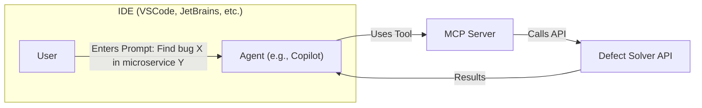

# Defect Solver Usage Guide 

Our defect solver API is exposed via our MCP server, which provides a set of prompts and tools to assist in the bug localization and resolution process. This guide explains how to use the MCP server effectively.

## What our server offers
1. Tools: To be used by **AGENT** (such as Copilot) to perform bug localization tasks by sending request to our MCP Server.
2. Prompts: To be used by **YOU** (as developer) to interact effectively with agents and guide them through the bug resolution process.

Below is an example:



## Overview of Prompts and Tools

- Below is a summary of the available tools for **AGENT**, to be used for bug localization:
  
| | Tool Name                      | Purpose                                                      | When to Use                                              |
|---|------------------------------- |--------------------------------------------------------------|----------------------------------------------------------|
| 1 | `multi_module_bug_localization` | Localize bug across all microservices                        | When responsible microservice is unknown                 |
| 2 | `single_module_bug_localization`| Localize bug within a specific microservice                   | When affected module is known or strongly suspected      |
| 3 | `search_space_routing`          | Identify likely microservices (search spaces) for a bug      | To narrow down investigation before deeper localization  |


- Below is a summary of the available prompts for **YOU**, to be used to guide the agent through the bug resolution process:

| | Prompt Name | Title                                 | Purpose                                                     | When to Use                                                    |
|---|-------------|----------------------------------------|-------------------------------------------------------------|----------------------------------------------------------------|
| 1 | `prompt_select_tool`         | Select Bug Localization Tool         | Decide which bug localization tool(s) to use                 | Right after receiving a bug description                        |
| 2 | `prompt_augment_bug_report`  | Augment Bug Report with Technical Details | Enrich the bug report using codebase access             | After tool selection, when agent has codebase access           |
| 3 | `prompt_revise_bug_report`   | Revise Bug Report                     | Improve clarity of the description without codebase          | When codebase access is not available                          |
| 4 | `prompt_find_bug`            | Localize and Find Bug Using Selected Tool | Run the localization tool and collect output          | After preparing enriched or revised bug description            |
| 5 | `prompt_explain`             | Explain Localization Results          | Interpret and prioritize tool output                         | After localization tool has returned results                   |
| 6 | `prompt_fix_bug`             | Fix Localized Bug                     | Investigate files and apply actual fix                       | After tool output identifies target files                      |
| 7 | `prompt_full_workflow`       | Full Bug Resolution Workflow          | Run the entire bug-fixing process in one step                | For complete automation or agent-driven debugging              |

## Tool Usage Guide
- **NOTE:** The tools are designed to be used by an agent (like Copilot) that can send requests to the defect solver API. You, as a developer, will interact with the agent using our prompts, or you can explicitly ask the agent to use a specific tool.

### 1. multi_module_bug_localization
**Name:** multi_module_bug_localization

**Purpose:** Performs bug localization across the entire microservice architecture by first identifying likely microservices (search spaces) and then locating the bug-related files within them.

**When to Use:**
- When the responsible microservice for a bug is unknown.
- For system-wide or cross-module issues.
- As the default entry point for new or ambiguous bug reports.

**Input:** `MultiModuleRequest` (issue key, summary, description)

**Output:** Selected microservices and localized file paths likely related to the bug.

> **NOTE:** For `multi_module_bug_localization`, the tool selects the module (microservice) name(s) automatically as part of its process.

**Flowchart:**
```plaintext
[Start]
   |
   v
[User Provides Bug Description]
   |
   v
[search_space_routing]
   |
   v
[List of Likely Microservices/Modules]
   |
   v
[multi_module_bug_localization]
   |
   v
[Return Files/Locations Likely Related to Bug]
   |
   v
[End]
```

### 2. single_module_bug_localization
**Name:** single_module_bug_localization

**Purpose:** Performs bug localization within a specific module (microservice) of a microservice architecture.

**When to Use:**
- When you already know or have strong suspicion about the affected module.
- For module-specific or localized issues.
- After narrowing down the search space using other tools.

**Input:** `SingleModuleRequest` (issue key, summary, description, module name)

**Output:** Localized file paths within the specified module.

> **NOTE:** For `single_module_bug_localization`, the module name is provided by the user.

**Flowchart:**
```plaintext
[Start]
   |
   v
[User Provides Bug Description + Module Name]
   |
   v
[single_module_bug_localization]
   |
   v
[Localize Bug in Given Module]
   |
   v
[Return Files/Locations Likely Related to Bug]
   |
   v
[End]
```

### 3. search_space_routing
**Name:** search_space_routing

**Purpose:** Identifies and returns the most likely microservices (search spaces) that could be the source of a reported bug.

**When to Use:**
- When the source of the bug is unknown and you want to narrow down the investigation.
- As a first step before running module- or file-level localization.
- To prioritize which microservices to investigate further.

**Input:** `SearchSpaceRoutingRequest` (issue key, summary, description)

**Output:** List of candidate microservices (search spaces) most likely responsible for the bug.

**Flowchart:**
```plaintext
[Start]
   |
   v
[User Provides Bug Description]
   |
   v
[search_space_routing]
   |
   v
[List of Likely Microservices/Modules]
   |
   v
[End]
```

##  Prompt Usage Guide

### 1. prompt_select_tool
**Title:** Select Bug Localization Tool

**Purpose:** Helps decide the optimal bug localization tool(s) to use based on the bug description.

**When to Use:**
- When a bug description is first provided
- Before calling any localization or augmentation tools
- When deciding between space-level, module-level, or full-system tools


### 2. prompt_augment_bug_report
**Title:** Augment Bug Report with Technical Details

**Purpose:** Enrich the bug report with internal technical details using full codebase access (e.g., modules, class names, APIs, architectural layers).


**When to Use:**
- After selecting a localization tool
- During root cause analysis (e.g., Copilot/LLM with codebase access)
- To improve localization tool input or augment descriptions for future steps


### 3. prompt_revise_bug_report
**Title:** Revise Bug Report

**Purpose:** Improve the clarity and technical precision of a bug description when codebase access is not available.

**When to Use:**
- During the revision stage, after tool selection but before localization
- When Copilot/LLMs do not have access to the codebase
- When you want to enhance a user-provided description using general technical reasoning only


### 4. prompt_find_bug
**Title:** Localize and Find Bug Using Selected Tool

**Purpose:** Guide the execution of the selected bug localization tool.

**When to Use:**
- After augmenting or revising the bug description, and selecting the localization strategy.


### 5. prompt_explain
**Title:** Explain Localization Results

**Purpose:** Interpret the results from localization tools and suggest next actions. Translate the tool output into an actionable plan for a human developer (e.g., file triage, investigation order).

**When to Use:**
- After receiving results from bug localization tool

### 6. prompt_fix_bug
**Title:** Fix Localized Bug

**Purpose:** Apply an actual code fix starting from the files identified by the localization tool.

**When to Use:**
- After localization results point to specific files
- During the debugging/fixing stage of the workflow
- While using Copilot-like LLM with codebase access


### 7. prompt_full_workflow
**Title:** Full Bug Resolution Workflow

**Purpose:** Run a complete workflow from bug description to code fix.

**When to Use:**
- For end-to-end automation or human-in-the-loop resolution
- When the user wants to go from raw bug report to fixed code in one flow

### Flowchart: Bug Resolution Workflow

```plaintext
[Start]
   |
   v
[User Provides Bug Description]
   |
   v
[prompt_select_tool]
   |
   v
[Was Codebase Access Granted?]
       /          \
      /            \
[Yes]              [No]
  |                  |
  v                  v
[prompt_          [prompt_
augment_           revise_
bug report]      bug_report]
  |                  |
   \                /
    \              /
     v            v
[prompt_find_bug (Run selected tool)]
   |
   v
[prompt_explain (Analyze results)]
   |
   v
[prompt_fix_bug (Apply fix)]
   |
   v
[End]
```


