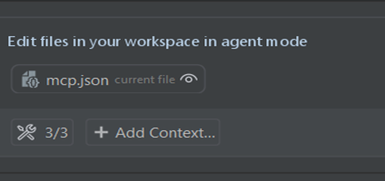
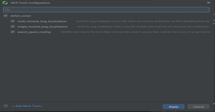

# Integrating Defect Solver MCP Tools into GitHub Copilot Chat in IntelliJ IDE

---

## 1. Open IntelliJ IDE

- Launch IntelliJ IDE and ensure your project is open.

---

## 2. Start GitHub Copilot Chat

- Click the **GitHub Copilot** icon on the right panel  
  or use the top menu to choose:  
  `GitHub Copilot → Open Chat`.

---

## 3. Switch to Agent Mode

- In the Copilot Chat input box, switch from **Ask** to **Agent** using the dropdown menu.


>  **Note:** If you don’t see the **Agent** option, you may need to update your IntelliJ IDE to the latest version.

---

## 4. Open MCP Tools Configuration Panel

- In the Copilot Chat panel, click the **tools** button.
- This will open the **MCP Tools Configuration** interface.


- Click **“+ Add MCP Tools”**.


- This will open the `mcp.json` file.

---

## 5. Edit or Create `mcp.json`

- If no configuration exists, you'll see a placeholder with commented examples.

 

- Create or update the file to look like this:
  * If you are using **private MCP server** hosted on Hugging Face Space:
  
```json
{
    "servers": {        
        "ds": {
            "url": "https://dnext-ds-mcp-server.hf.space/mcp/",
            "type": "http",
            "headers": {
                "DS-API-Key": "${input:defect-solver-api-key}",
                "Authorization": "Bearer ${input:hf-access-token}"
            }
        }
    },
    "inputs": [
        {
            "type": "promptString",
            "id": "defect-solver-api-key",
            "description": "Enter your Defect Solver API Key",
            "password": true
        },
        {
            "type": "promptString",
            "id": "hf-access-token",
            "description": "Enter your Hugging Face Access Token",
            "password": true  
        }
    ]
}

```
You need to enter defect-solver-api-key and hf-access-token as inputs.

  * If you are using a **public/local MCP server** hosted on Hugging Face Space:


```json
{
    "servers": {
        "ds": {
            "url": "https://dnext-ds-mcp-server.hf.space/mcp/",
            "type": "http",
            "headers": {
                "DS-API-Key": "${input:defect-solver-api-key}"
            }
        }
    },
    "inputs": [
        {
            "type": "promptString",
            "id": "defect-solver-api-key",
            "description": "Enter your Defect Solver API Key",
            "password": true
        }
    ]
}
```   
You only need to enter defect-solver-api-key as input.
- If you are using local MCP server, you can replace the URL with your local server endpoint (e.g. http://0.0.0.0:8000/mcp)  and remove the headers section.


- Make sure to replace the URL with your MCP server endpoint and add your API key.
- After saving mcp.json, tools under your MCP server (e.g., defect_solver) will appear in the tools panel in chat.



- You can enable/disable them as needed.



>  **Note:** Prompt commands (e.g. typing / to list and run prompts) are not supported in IntelliJ at the moment.
You can only use the tools, not the custom prompts.
