# 🛠️ Integrating Defect Solver MCP Tools into VSCode Copilot Chat: Step-by-Step Guide

---

## 1. Open VS Code

- Launch your VS Code editor.

---

## 2. Start a Chat with GitHub Copilot

- Click the **Copilot** icon in the top menu bar.
- Select **“Open Chat”** from the dropdown.

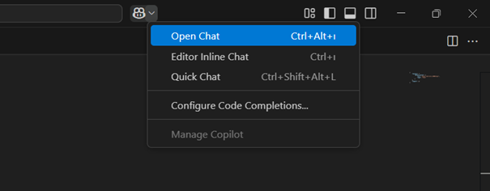
---

## 3. Select an Agent and Open the Tool Button

- Make sure you select an **agent**.
- After selecting the agent, click the **tool** button that appears in the chat input panel.

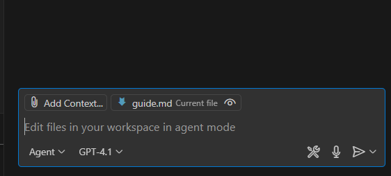
---

## 4. Add More Tools

- In the tool selection window, scroll down and click **“Add More Tools…”**.

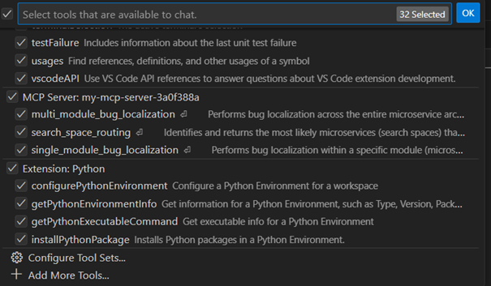


* Depending on your VS Code version, you may see a **“Add MCP Server”** button as followed below: (Skip the 5th step if you see this button)

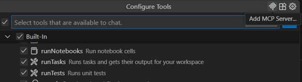
---


## 5. Add MCP Server

- Click **“Add MCP Server…”** from the tool options.

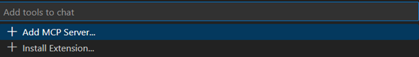
---

## 6. Choose the MCP Server Type

- Select **“HTTP (HTTP or Server-Sent Events)”** as the type of MCP server.

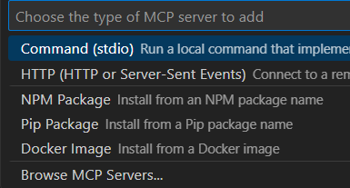
---

## 7. Enter the MCP Server URL

- Enter the server URL.  
- For example: `http://127.0.0.1:8000/mcp/` if it is running locally.

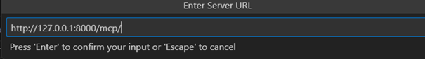
---

## 8. Enter a Server ID

- Enter a Server ID (required).
- You can choose any name you like, such as `defect_solver`.

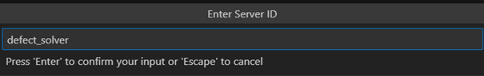
---

## 9. Choose Installation Scope

- Choose where to install the MCP server.
- Select **Global** to make it available in all workspaces, or **Workspace** to limit it to the current one.

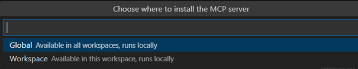
---

## 10. mcp.json File Creation

- After selecting **Global**, a `mcp.json` file will be automatically created.
- You can find it in your workspace.  
  It will contain the MCP server configuration.

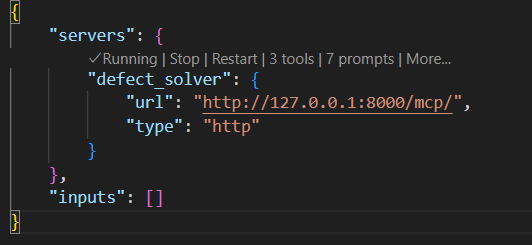
---

## 11. Configure MCP Server
- Open the `mcp.json` file in your workspace.
- Ensure it contains the correct server URL and ID.
- You can also add an API key for authentication.
- It should look something like this:

  * If you are using **private MCP server** hosted on Hugging Face Space:
  
```json
{
    "servers": {        
        "ds": {
            "url": "https://dnext-coder-mcp-server.pia-team.com/mcp/",
            "type": "http",
            "headers": {
                "DS-API-KEY": "${input:defect-solver-api-key}"
            }
        }
    },
    "inputs": [
        {
            "type": "promptString",
            "id": "defect-solver-api-key",
            "description": "Enter your Defect Solver API Key",
            "password": true
        }
    ]
}

```
You need to enter defect-solver-api-key as inputs.

- If you are using local MCP server, you can replace the URL with your local server endpoint (e.g. http://0.0.0.0:8000/mcp)  and remove the headers section.


## 12. Ensure MCP Server is Running

- Make sure your MCP server is running.
- You should see **“✓ Running”** in the status bar.  
  If it’s not running, click **Start** or **Restart**.


---

## 13. Open Tool Selection in Chat

- Once the server is running, click the **tools** button in the chat interface.
- You will now see your custom MCP tools listed under the server name (e.g., `defect_solver`).
- Make sure they are checked ✅ so you can use them in the chat.

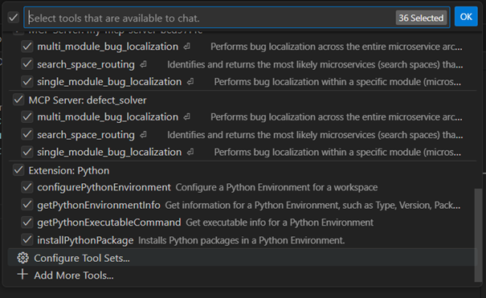

>  **Note:** multi_module_bug_localization tool is now deprecated. 
---

## 14. Use Prompts via `/` Command

- You can also list and select prompts by typing `/` in the chat input.
- This will show all available prompts from your MCP server (e.g., `defect_solver`).
- Just click on any prompt (like `/mcp.defect_solver.prompt_find_bug`) to insert and run it.

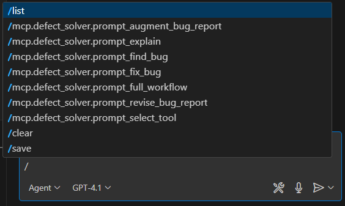