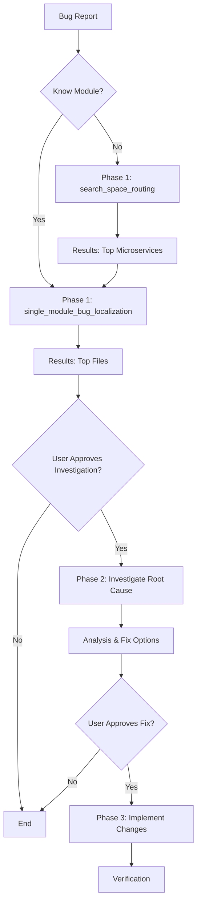

# Defect Solver User Guide

## Overview

Defect Solver is a bug localization system for large microservice architectures. It helps you pinpoint buggy files across multiple repositories using natural language bug descriptions. The system is exposed through an MCP (Model Context Protocol) server that integrates seamlessly with AI coding assistants like GitHub Copilot.

```
┌─────────┐          ┌─────────────┐          ┌──────────────┐
│   You   │  prompt  │  AI Agent   │   tool   │  MCP Server  │
│         ├─────────►│  (Copilot)  ├─────────►│ (DNext Coder)│
└─────────┘          └─────────────┘          └──────┬───────┘
                                                      │
                                                      ▼
                                              ┌───────────────┐
                                              │ Defect Solver │
                                              │      API      │
                                              └───────────────┘
```

## What We Provide

### MCP Tools (For AI Agents)

The MCP server exposes two main tools that AI agents can use:

#### 1. `search_space_routing`
**Purpose:** Identifies the top-N microservices (repositories) most likely responsible for a bug.

**Use When:** You don't know which microservice contains the bug.

**Input:**
- `summary`: Short bug title
- `description`: Detailed bug description

**Output:** List of candidate microservices ranked by relevance.

**Example Use Case:**
```
Bug: "User login fails with 500 error"
→ Tool returns: ["account", "authentication", "user-profile"]
```

---

#### 2. `single_module_bug_localization`
**Purpose:** Locates the top-N files within a specific microservice that likely contain the bug.

**Use When:** You know (or have narrowed down) which microservice has the bug.

**Input:**
- `summary`: Short bug title
- `description`: Detailed bug description
- `module`: Name of the microservice

**Output:** Ranked list of file paths within that microservice.

**Example Use Case:**
```
Bug: "User login fails with 500 error"
Module: "account"
→ Tool returns:
  1. src/.../controller/AuthController.java
  2. src/.../service/LoginService.java
  3. src/.../validator/CredentialValidator.java
```

---

### MCP Prompts (For Developers)

We provide structured prompts to guide AI agents through the bug resolution workflow:

| Prompt | Purpose | When to Use |
|--------|---------|-------------|
| **Localize and Find Bug Using Selected Tool** | Execute localization tools and get starting points | When you have a bug description and need to find likely files/microservices |
| **Investigate Root Cause** | Analyze localization results and determine root cause | After localization, to understand what's causing the bug and explore fix options |
| **Implement Bug Fix** | Apply approved code changes | Only after investigation phase and user approval to implement the fix |

**Workflow**: Localization → Investigation (with approval) → Implementation (with approval)

**Key Principles**:
- Tools provide **starting points**, not definitive answers
- Always use **original bug descriptions** (never augment before passing to tools)
- Require **user approval** before each phase transition

---

## Installation & Setup

### Prerequisites

- VS Code or JetBrains IDE with MCP support
- API access key (contact [Lokum AI](https://github.com/lokumai) to request)

### Step 1: Configure MCP Client

Add the DNext Coder MCP server to your IDE's MCP configuration:

**For VS Code:**

Official guide: [VS Code MCP Servers Documentation](https://code.visualstudio.com/docs/copilot/customization/mcp-servers)

Edit `mcp.json` (usually located in your user settings):

```json
{
  "mcpServers": {
    "dnext-coder-mcp": {
      "url": "https://dnext-coder-mcp-server.pia-team.com/mcp/",
      "type": "http",
      "headers": {
        "DS-API-KEY": "${input:defect-solver-api-key}"
      }
    }
  }
}
```

**For JetBrains IDEs:**

Official guide: [JetBrains AI Assistant MCP Documentation](https://www.jetbrains.com/help/ai-assistant/mcp.html#connect-to-an-mcp-server)

Edit your MCP configuration file (location varies by IDE):

```json
{
  "mcpServers": {
    "dnext-coder-mcp": {
      "url": "https://dnext-coder-mcp-server.pia-team.com/mcp/",
      "type": "http",
      "headers": {
        "DS-API-KEY": "${input:defect-solver-api-key}"
      }
    }
  }
}
```

**For Cursor:**

Official guide: [Cursor MCP Documentation](https://cursor.com/docs/context/mcp)

Follow the same configuration format as VS Code above.

### Step 2: Restart Your IDE

Restart your IDE to load the MCP server configuration.

### Step 3: Verify Connection

In your AI assistant chat (e.g., GitHub Copilot):
```
Can you check if the dnext-coder MCP server is available?
```

The agent should confirm it can access the `search_space_routing` and `single_module_bug_localization` tools.

---

## Usage Workflow

### Typical Workflow



### Example: Full Bug Resolution

**Scenario:** "User cannot update their profile picture"

**Phase 1: Localization**
```
You: Use the "Localize and Find Bug" prompt with my bug description.

Agent: [Calls search_space_routing]
       Results (starting points): 
       1. user-profile (score: 0.85)
       2. document (score: 0.72)
       3. account (score: 0.61)
       
       Would you like me to investigate user-profile module?

You: Yes, proceed.

Agent: [Calls single_module_bug_localization with module="user-profile"]
       Results (starting points):
       1. service/ProfileImageService.java
       2. controller/ProfileController.java
       3. validator/ImageValidator.java
       
       These are starting points. Shall I investigate?
```

**Phase 2: Investigation (User Approval Required)**
```
You: Yes, investigate the root cause.

Agent: [Analyzes identified files]
       Root Cause: ProfileImageService has file size validation limit of 1MB,
       but frontend allows 5MB uploads.
       
       Fix Options:
       1. Increase backend limit to 5MB
       2. Decrease frontend limit to 1MB
       3. Make limit configurable
       
       Shall I implement option 1 (increase to 5MB)?
```

**Phase 3: Implementation (User Approval Required)**
```
You: Yes, implement option 1.

Agent: [Applies changes to ProfileImageService.java]
       Changed: MAX_FILE_SIZE from 1MB to 5MB
       Updated: Validation message
       Suggested tests: Upload 2MB, 4MB, 6MB files
```

---

## Best Practices

### 1. Write Clear Bug Descriptions
✅ **Good:**
```
Summary: Payment processing fails for amounts over $1000
Description: When users try to pay more than $1000, the checkout page 
shows "Transaction Error" and logs show "Amount validation failed" 
in the payment service. This happens consistently across all payment methods.
```

❌ **Bad:**
```
Summary: Payment broken
Description: Doesn't work
```

### 2. Follow the Three-Phase Workflow
1. **Localization**: Get starting points from tools (don't modify your bug description)
2. **Investigation**: Approve before agent investigates files
3. **Implementation**: Approve before agent applies changes

### 3. Trust the Approval Gates
- Tools provide **starting points**, not definitive answers
- Always **review results** before proceeding to next phase
- Agent will **ask permission** before investigating or changing code
- You maintain **full control** throughout the workflow

### 4. Use Original Bug Descriptions
- **Never augment or modify** your bug description before tool calls
- Let tools work with **your exact words**
- Technical augmentation is for your review only, not tool input

### 5. Iterate Intelligently
If initial results don't lead to the bug:
- Review next ranked microservice or file
- Provide additional context in conversation (not in original bug description)
- Ask agent to investigate related patterns in identified areas

---

## Troubleshooting

### "API Key Invalid" Error
- Verify your `DS-API-KEY` is correctly set in MCP configuration
- Check with [Lokum AI](https://github.com/lokumai) that your key is active
- Restart your IDE after updating the key

### Tool Returns Empty Results
- Ensure bug description is detailed and technical
- Check if microservice name is spelled correctly (for single_module tool)
- Verify the microservice exists in the DNext architecture

### Agent Cannot Find MCP Tools
- Confirm MCP server URL is correct
- Check network connectivity to `dnext-coder-mcp-server.pia-team.com`
- Verify IDE has MCP support enabled

---

## Using AGENTS.md for Better Results

For optimal agent behavior, place the [AGENTS.md](../resources/AGENTS.md) file in your project root. This provides:
- High-level workflow guidance for the AI agent
- DNext microservices reference
- TMForum compliance context
- Approval gate enforcement

See the [AGENTS.md file](../resources/AGENTS.md) for details.

---

## Support & Contact

For API access, technical support, or feature requests:
- **GitHub:** [Lokum AI](https://github.com/lokumai)

---

## Next Steps

- **For Developers:** See [Developer Guide](dev_guide.md) for system maintenance
- **For Researchers:** See [Algorithm Details](algorithm.md) to understand how it works