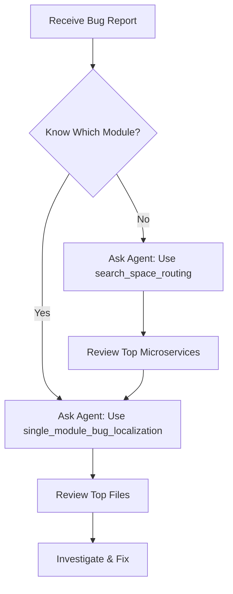

# Defect Solver User Guide

## Overview

Defect Solver is a bug localization system for large microservice architectures. It helps you pinpoint buggy files across multiple repositories using natural language bug descriptions. The system is exposed through an MCP (Model Context Protocol) server that integrates seamlessly with AI coding assistants like GitHub Copilot.

```
┌─────────┐          ┌─────────────┐          ┌──────────────┐
│   You   │  prompt  │  AI Agent   │   tool   │  MCP Server  │
│         ├─────────►│  (Copilot)  ├─────────►│ (DNext Coder)│
└─────────┘          └─────────────┘          └──────┬───────┘
                                                      │
                                                      ▼
                                              ┌───────────────┐
                                              │ Defect Solver │
                                              │      API      │
                                              └───────────────┘
```

## What We Provide

### MCP Tools (For AI Agents)

The MCP server exposes two main tools that AI agents can use:

#### 1. `search_space_routing`
**Purpose:** Identifies the top-N microservices (repositories) most likely responsible for a bug.

**Use When:** You don't know which microservice contains the bug.

**Input:**
- `summary`: Short bug title
- `description`: Detailed bug description

**Output:** List of candidate microservices ranked by relevance.

**Example Use Case:**
```
Bug: "User login fails with 500 error"
→ Tool returns: ["account", "authentication", "user-profile"]
```

---

#### 2. `single_module_bug_localization`
**Purpose:** Locates the top-N files within a specific microservice that likely contain the bug.

**Use When:** You know (or have narrowed down) which microservice has the bug.

**Input:**
- `summary`: Short bug title
- `description`: Detailed bug description
- `module`: Name of the microservice

**Output:** Ranked list of file paths within that microservice.

**Example Use Case:**
```
Bug: "User login fails with 500 error"
Module: "account"
→ Tool returns:
  1. src/.../controller/AuthController.java
  2. src/.../service/LoginService.java
  3. src/.../validator/CredentialValidator.java
```

---

### MCP Prompts (For Developers)

We provide structured prompts to guide AI agents through the bug resolution workflow:

| Prompt | Purpose | When to Use |
|--------|---------|-------------|
| `prompt_select_tool` | *[Coming Soon]* | Select appropriate bug localization strategy |
| `prompt_augment_bug_report` | *[Coming Soon]* | Enrich bug description with technical details |
| `prompt_revise_bug_report` | *[Coming Soon]* | Improve bug description clarity |
| `prompt_find_bug` | *[Coming Soon]* | Execute localization and collect results |
| `prompt_explain` | *[Coming Soon]* | Interpret and prioritize localization results |
| `prompt_fix_bug` | *[Coming Soon]* | Apply actual code fixes to identified files |
| `prompt_full_workflow` | *[Coming Soon]* | Run complete bug resolution end-to-end |

> **Note:** Prompt implementation details will be updated in future releases.

---

## Installation & Setup

### Prerequisites

- VS Code or JetBrains IDE with MCP support
- API access key (contact [Lokum AI](https://github.com/lokumai) to request)

### Step 1: Configure MCP Client

Add the DNext Coder MCP server to your IDE's MCP configuration:

**For VS Code:**

Official guide: [VS Code MCP Servers Documentation](https://code.visualstudio.com/docs/copilot/customization/mcp-servers)

Edit `mcp.json` (usually located in your user settings):

```json
{
  "mcpServers": {
    "dnext-coder": {
      "url": "https://dnext-coder-mcp-server.pia-team.com/sse",
      "headers": {
        "DS-API-KEY": "your-api-key-here"
      }
    }
  }
}
```

**For JetBrains IDEs:**

Official guide: [JetBrains AI Assistant MCP Documentation](https://www.jetbrains.com/help/ai-assistant/mcp.html#connect-to-an-mcp-server)

Edit your MCP configuration file (location varies by IDE):

```json
{
  "mcpServers": {
    "dnext-coder": {
      "url": "https://dnext-coder-mcp-server.pia-team.com/sse",
      "headers": {
        "DS-API-KEY": "your-api-key-here"
      }
    }
  }
}
```

**For Cursor:**

Official guide: [Cursor MCP Documentation](https://cursor.com/docs/context/mcp)

Follow the same configuration format as VS Code above.

### Step 2: Restart Your IDE

Restart your IDE to load the MCP server configuration.

### Step 3: Verify Connection

In your AI assistant chat (e.g., GitHub Copilot):
```
Can you check if the dnext-coder MCP server is available?
```

The agent should confirm it can access the `search_space_routing` and `single_module_bug_localization` tools.

---

## Usage Workflow

### Typical Workflow



### Example: Full Bug Resolution

**Scenario:** "User cannot update their profile picture"

**Step 1: Route to Microservice**
```
You: "I have a bug where users cannot update their profile picture. 
     Use the search_space_routing tool to find which microservices might be responsible."

Agent: [Calls search_space_routing tool]
       Results: 
       1. user-profile (score: 0.85)
       2. document (score: 0.72)
       3. account (score: 0.61)
```

**Step 2: Localize Files**
```
You: "Now use single_module_bug_localization on the 'user-profile' module."

Agent: [Calls single_module_bug_localization with module="user-profile"]
       Results:
       1. controller/ProfileController.java
       2. service/ProfileImageService.java
       3. validator/ImageValidator.java
       4. repository/ProfileRepository.java
       ...
```

**Step 3: Investigate & Fix**
```
You: "Show me the ProfileImageService.java file and check for issues."

Agent: [Opens file and analyzes code]
       Found issue: File size validation is too strict (1MB limit).
       Suggesting fix...
```

---

## Best Practices

### 1. Write Clear Bug Descriptions
✅ **Good:**
```
Summary: Payment processing fails for amounts over $1000
Description: When users try to pay more than $1000, the checkout page 
shows "Transaction Error" and logs show "Amount validation failed" 
in the payment service. This happens consistently across all payment methods.
```

❌ **Bad:**
```
Summary: Payment broken
Description: Doesn't work
```

### 2. Use Progressive Narrowing
1. Start with `search_space_routing` if uncertain
2. Use results to select 1-2 most likely microservices
3. Run `single_module_bug_localization` on each candidate
4. Investigate top-ranked files first

### 3. Combine Tools with Codebase Access
- Let the agent access your full codebase for context
- Use localization tools to prioritize investigation
- Don't rely solely on tool output—verify findings

### 4. Iterate When Needed
If initial results don't lead to the bug:
- Refine your bug description with more technical details
- Try the next ranked microservice or file
- Ask the agent to search for related code patterns

---

## Troubleshooting

### "API Key Invalid" Error
- Verify your `DS-API-KEY` is correctly set in MCP configuration
- Check with [Lokum AI](https://github.com/lokumai) that your key is active
- Restart your IDE after updating the key

### Tool Returns Empty Results
- Ensure bug description is detailed and technical
- Check if microservice name is spelled correctly (for single_module tool)
- Verify the microservice exists in the DNext architecture

### Agent Cannot Find MCP Tools
- Confirm MCP server URL is correct
- Check network connectivity to `dnext-coder-mcp-server.pia-team.com`
- Verify IDE has MCP support enabled

---

## Support & Contact

For API access, technical support, or feature requests:
- **GitHub:** [Lokum AI](https://github.com/lokumai)

---

## Next Steps

- **For Developers:** See [Developer Guide](dev_guide.md) for system maintenance
- **For Researchers:** See [Algorithm Details](algorithm.md) to understand how it works